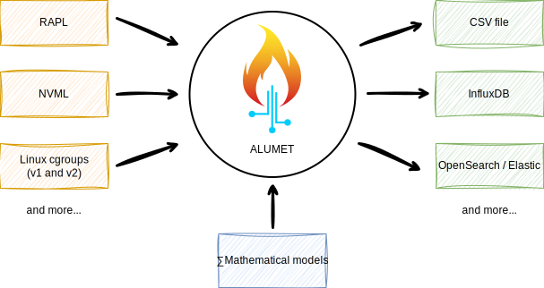

# Introduction

Welcome to the ALUMET user guide!
If you want to measure something with ALUMET, you have come to the right place.

To skip the introduction and install ALUMET, [click here](installation/install.md).

## What is ALUMET?

ALUMET is a modular and efficient software measurement tool. With ALUMET, you can:
- measure the energy consumption of your CPU, GPU, and more
- assign the energy consumption of hardware resources to their consumers (such as processes, K8S pods, containers, etc.)
- gather performance metrics at a configurable frequency
- monitor laptops, desktops and HPC servers
- profile your applications

ALUMET (sometimes written "Alumet") is acronym for _Adaptive, Lightweight, Unified METrics_.

## High-level architecture

The measurement sources (in yellow), data transforms (in blue) and outputs (in green) are provided by _plugins_, not by Alumet's core.
Plugins are developed as separate software libraries. This is an improvement over monolithic tools, because it allows developers to easily extend the capabilities of the tool,
in every part of the measurement pipeline (sources -> transforms -> outputs).

We offer many "standard" plugins, but you are free to create your own, for instance if you want to gather metrics from a piece of hardware that we do not support. Please read the [developer guide](todo) to learn more about the creation of plugins.

### Performance

The _L_ in Alumet stands for _Lightweight_. Why is Alumet "lightweight" compared to other measurement tools?
1. **Optimized pipeline**: Alumet is written in Rust, optimized for minimal latency and low memory consumption.
2. **Efficient interfaces**: When we develop a new measurement source, we try to find the most efficient way of measuring what we're interested in. As a result, many plugins are based on low-level interfaces, such as the Linux [perf_events interface](https://man.archlinux.org/man/perf_event_open.2.fr), instead of slower higher-level wrappers. In particular, we try to remove useless intermediate levels, such as calling an external program and parsing its text output.
3. **Pay only for what you need**: Alumet's modularity allows you to create a bespoke measurement tool by choosing the plugins that suit your needs, and removing the rest. You don't need a mathematical model that assigns the energy consumption of hardware components to processes? Remove it, and enjoy an even smaller disk footprint, CPU overhead, memory use and energy consumption.

Read more about the advantages of Alumet on the next page: [Why ALUMET and not \<X\>?](./why_alumet.md).

## Does it work on \<my_machine>\?

For now, Alumet works in the following environments:
- Operating Systems: Linux, ~~macOS[^os], Windows[^os]~~
- Hardware components[^component]:
    - CPUs: Intel x86 processors (Sandy Bridge or more recent), AMD x86 processors (Zen 1 or more recent), NVIDIA Jetson CPUs (any model)
    - GPUs: NVIDIA dedicated GPUs, NVIDIA Jetson GPUs (any model)

[^os]: While the core of Alumet is cross-platform, many plugins only work on Linux, for example the RAPL and perf plugins. There is no macOS-specific nor Windows-specific plugin for the moment, so Alumet will not be able to measure interesting metrics on these systems.

[^component]: If your computer contains both supported and unsupported components, you can still use Alumet (with the plugins corresponding to the supported components). It will simply not measure the unsupported components.
