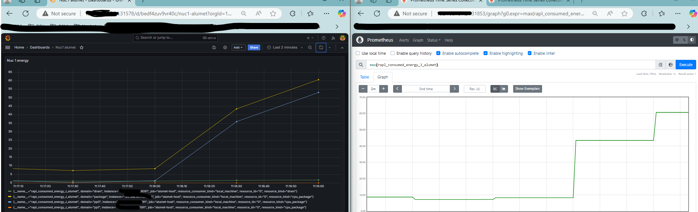

# Prometheus Exporter Output Plugin

## Description

[Prometheus](https://prometheus.io/docs/introduction/overview/) is an open source system for monitoring and alerting based on the collection (pull-based) of metrics in a Time Series Data Base (TSDB).

The plugin developed is an standard prometheus exporter which is exposed as a web service (with endpoint /metrics) to be reached by the prometheus system to pull the alumet's metrics.

## Configuration

The plugin can be configured via the alumet's config.toml file with the following options:

```toml
[plugins.prometheus-exporter]
host = "0.0.0.0"
prefix = ""
suffix = "_alumet"
port = 9091
append_unit_to_metric_name = true
use_unit_display_name = true
add_attributes_to_labels = true
```

## Examples

The plugin has been tested on both, local environment and a K8s.

### Simple local example

The plugin can be tested in a local environment with the Alumet's default configuration for it and results in the ability of downloading the metrics from http://localhost:9091/metrics.

Note that the list of metrics available will vary based on the input plugins used.

```text
# HELP mem_total_kB_alumet ?.
# TYPE mem_total_kB_alumet gauge
mem_total_kB_alumet{resource_consumer_id="",resource_consumer_kind="local_machine",resource_id="",resource_kind="local_machine"} 12372303872.0
# HELP mem_free_kB_alumet ?.
# TYPE mem_free_kB_alumet gauge
mem_free_kB_alumet{resource_consumer_id="",resource_consumer_kind="local_machine",resource_id="",resource_kind="local_machine"} 1491062784.0
# HELP mem_available_kB_alumet ?.
# TYPE mem_available_kB_alumet gauge
mem_available_kB_alumet{resource_consumer_id="",resource_consumer_kind="local_machine",resource_id="",resource_kind="local_machine"} 5022056448.0
# HELP cached_kB_alumet ?.
# TYPE cached_kB_alumet gauge
cached_kB_alumet{resource_consumer_id="",resource_consumer_kind="local_machine",resource_id="",resource_kind="local_machine"} 3523051520.0
# HELP swap_cached_kB_alumet ?.
# TYPE swap_cached_kB_alumet gauge
swap_cached_kB_alumet{resource_consumer_id="",resource_consumer_kind="local_machine",resource_id="",resource_kind="local_machine"} 54939648.0
# HELP active_kB_alumet ?.
# TYPE active_kB_alumet gauge
active_kB_alumet{resource_consumer_id="",resource_consumer_kind="local_machine",resource_id="",resource_kind="local_machine"} 2447753216.0
# HELP inactive_kB_alumet ?.
# TYPE inactive_kB_alumet gauge
inactive_kB_alumet{resource_consumer_id="",resource_consumer_kind="local_machine",resource_id="",resource_kind="local_machine"} 7838990336.0
# HELP mapped_kB_alumet ?.
# TYPE mapped_kB_alumet gauge
mapped_kB_alumet{resource_consumer_id="",resource_consumer_kind="local_machine",resource_id="",resource_kind="local_machine"} 230359040.0
# HELP kernel_cpu_time_ms_alumet busy CPU time.
# TYPE kernel_cpu_time_ms_alumet gauge
kernel_cpu_time_ms_alumet{cpu_state="idle",resource_consumer_id="",resource_consumer_kind="local_machine",resource_id="11",resource_kind="cpu_core"} 4950.0
kernel_cpu_time_ms_alumet{cpu_state="steal",resource_consumer_id="",resource_consumer_kind="local_machine",resource_id="1",resource_kind="cpu_core"} 0.0
kernel_cpu_time_ms_alumet{cpu_state="idle",resource_consumer_id="",resource_consumer_kind="local_machine",resource_id="7",resource_kind="cpu_core"} 4900.0
kernel_cpu_time_ms_alumet{cpu_state="steal",resource_consumer_id="",resource_consumer_kind="local_machine",resource_id="2",resource_kind="cpu_core"} 0.0
kernel_cpu_time_ms_alumet{cpu_state="user",resource_consumer_id="",resource_consumer_kind="local_machine",resource_id="11",resource_kind="cpu_core"} 0.0
kernel_cpu_time_ms_alumet{cpu_state="softirq",resource_consumer_id="",resource_consumer_kind="local_machine",resource_id="11",resource_kind="cpu_core"} 0.0
kernel_cpu_time_ms_alumet{cpu_state="softirq",resource_consumer_id="",resource_consumer_kind="local_machine",resource_id="0",resource_kind="cpu_core"} 30.0
kernel_cpu_time_ms_alumet{cpu_state="softirq",resource_consumer_id="",resource_consumer_kind="local_machine",resource_id="3",resource_kind="cpu_core"} 0.0
kernel_cpu_time_ms_alumet{cpu_state="user",resource_consumer_id="",resource_consumer_kind="local_machine",resource_id="9",resource_kind="cpu_core"} 0.0
kernel_cpu_time_ms_alumet{cpu_state="guest",resource_consumer_id="",resource_consumer_kind="local_machine",resource_id="9",resource_kind="cpu_core"} 0.0
kernel_cpu_time_ms_alumet{cpu_state="system",resource_consumer_id="",resource_consumer_kind="local_machine",resource_id="",resource_kind="local_machine"} 270.0
kernel_cpu_time_ms_alumet{cpu_state="user",resource_consumer_id="",resource_consumer_kind="local_machine",resource_id="7",resource_kind="cpu_core"} 10.0
kernel_cpu_time_ms_alumet{cpu_state="guest_nice",resource_consumer_id="",resource_consumer_kind="local_machine",resource_id="6",resource_kind="cpu_core"} 0.0
kernel_cpu_time_ms_alumet{cpu_state="guest",resource_consumer_id="",resource_consumer_kind="local_machine",resource_id="2",resource_kind="cpu_core"} 0.0
kernel_cpu_time_ms_alumet{cpu_state="steal",resource_consumer_id="",resource_consumer_kind="local_machine",resource_id="5",resource_kind="cpu_core"} 0.0
kernel_cpu_time_ms_alumet{cpu_state="user",resource_consumer_id="",resource_consumer_kind="local_machine",resource_id="2",resource_kind="cpu_core"} 50.0
kernel_cpu_time_ms_alumet{cpu_state="nice",resource_consumer_id="",resource_consumer_kind="local_machine",resource_id="11",resource_kind="cpu_core"} 0.0
kernel_cpu_time_ms_alumet{cpu_state="guest_nice",resource_consumer_id="",resource_consumer_kind="local_machine",resource_id="4",resource_kind="cpu_core"} 0.0
kernel_cpu_time_ms_alumet{cpu_state="softirq",resource_consumer_id="",resource_consumer_kind="local_machine",resource_id="5",resource_kind="cpu_core"} 0.0
kernel_cpu_time_ms_alumet{cpu_state="guest_nice",resource_consumer_id="",resource_consumer_kind="local_machine",resource_id="0",resource_kind="cpu_core"} 0.0
kernel_cpu_time_ms_alumet{cpu_state="guest_nice",resource_consumer_id="",resource_consumer_kind="local_machine",resource_id="2",resource_kind="cpu_core"} 0.0
kernel_cpu_time_ms_alumet{cpu_state="guest_nice",resource_consumer_id="",resource_consumer_kind="local_machine",resource_id="3",resource_kind="cpu_core"} 0.0
kernel_cpu_time_ms_alumet{cpu_state="guest_nice",resource_consumer_id="",resource_consumer_kind="local_machine",resource_id="8",resource_kind="cpu_core"} 0.0
kernel_cpu_time_ms_alumet{cpu_state="steal",resource_consumer_id="",resource_consumer_kind="local_machine",resource_id="11",resource_kind="cpu_core"} 0.0
kernel_cpu_time_ms_alumet{cpu_state="user",resource_consumer_id="",resource_consumer_kind="local_machine",resource_id="5",resource_kind="cpu_core"} 0.0
kernel_cpu_time_ms_alumet{cpu_state="user",resource_consumer_id="",resource_consumer_kind="local_machine",resource_id="3",resource_kind="cpu_core"} 0.0
kernel_cpu_time_ms_alumet{cpu_state="nice",resource_consumer_id="",resource_consumer_kind="local_machine",resource_id="",resource_kind="local_machine"} 0.0
kernel_cpu_time_ms_alumet{cpu_state="steal",resource_consumer_id="",resource_consumer_kind="local_machine",resource_id="4",resource_kind="cpu_core"} 0.0
kernel_cpu_time_ms_alumet{cpu_state="softirq",resource_consumer_id="",resource_consumer_kind="local_machine",resource_id="2",resource_kind="cpu_core"} 0.0
kernel_cpu_time_ms_alumet{cpu_state="user",resource_consumer_id="",resource_consumer_kind="local_machine",resource_id="6",resource_kind="cpu_core"} 50.0
kernel_cpu_time_ms_alumet{cpu_state="user",resource_consumer_id="",resource_consumer_kind="local_machine",resource_id="1",resource_kind="cpu_core"} 20.0
kernel_cpu_time_ms_alumet{cpu_state="irq",resource_consumer_id="",resource_consumer_kind="local_machine",resource_id="2",resource_kind="cpu_core"} 0.0
kernel_cpu_time_ms_alumet{cpu_state="user",resource_consumer_id="",resource_consumer_kind="local_machine",resource_id="8",resource_kind="cpu_core"} 0.0
kernel_cpu_time_ms_alumet{cpu_state="steal",resource_consumer_id="",resource_consumer_kind="local_machine",resource_id="",resource_kind="local_machine"} 0.0
kernel_cpu_time_ms_alumet{cpu_state="softirq",resource_consumer_id="",resource_consumer_kind="local_machine",resource_id="6",resource_kind="cpu_core"} 0.0
kernel_cpu_time_ms_alumet{cpu_state="guest_nice",resource_consumer_id="",resource_consumer_kind="local_machine",resource_id="",resource_kind="local_machine"} 0.0
kernel_cpu_time_ms_alumet{cpu_state="irq",resource_consumer_id="",resource_consumer_kind="local_machine",resource_id="9",resource_kind="cpu_core"} 0.0
kernel_cpu_time_ms_alumet{cpu_state="system",resource_consumer_id="",resource_consumer_kind="local_machine",resource_id="8",resource_kind="cpu_core"} 10.0
kernel_cpu_time_ms_alumet{cpu_state="nice",resource_consumer_id="",resource_consumer_kind="local_machine",resource_id="0",resource_kind="cpu_core"} 0.0
kernel_cpu_time_ms_alumet{cpu_state="idle",resource_consumer_id="",resource_consumer_kind="local_machine",resource_id="9",resource_kind="cpu_core"} 4990.0
kernel_cpu_time_ms_alumet{cpu_state="guest",resource_consumer_id="",resource_consumer_kind="local_machine",resource_id="10",resource_kind="cpu_core"} 0.0
kernel_cpu_time_ms_alumet{cpu_state="softirq",resource_consumer_id="",resource_consumer_kind="local_machine",resource_id="8",resource_kind="cpu_core"} 0.0
kernel_cpu_time_ms_alumet{cpu_state="idle",resource_consumer_id="",resource_consumer_kind="local_machine",resource_id="0",resource_kind="cpu_core"} 4960.0
kernel_cpu_time_ms_alumet{cpu_state="guest",resource_consumer_id="",resource_consumer_kind="local_machine",resource_id="11",resource_kind="cpu_core"} 0.0
kernel_cpu_time_ms_alumet{cpu_state="guest_nice",resource_consumer_id="",resource_consumer_kind="local_machine",resource_id="7",resource_kind="cpu_core"} 0.0
kernel_cpu_time_ms_alumet{cpu_state="steal",resource_consumer_id="",resource_consumer_kind="local_machine",resource_id="9",resource_kind="cpu_core"} 0.0
kernel_cpu_time_ms_alumet{cpu_state="user",resource_consumer_id="",resource_consumer_kind="local_machine",resource_id="4",resource_kind="cpu_core"} 0.0
kernel_cpu_time_ms_alumet{cpu_state="irq",resource_consumer_id="",resource_consumer_kind="local_machine",resource_id="10",resource_kind="cpu_core"} 0.0
kernel_cpu_time_ms_alumet{cpu_state="softirq",resource_consumer_id="",resource_consumer_kind="local_machine",resource_id="10",resource_kind="cpu_core"} 0.0
kernel_cpu_time_ms_alumet{cpu_state="nice",resource_consumer_id="",resource_consumer_kind="local_machine",resource_id="6",resource_kind="cpu_core"} 0.0
kernel_cpu_time_ms_alumet{cpu_state="nice",resource_consumer_id="",resource_consumer_kind="local_machine",resource_id="4",resource_kind="cpu_core"} 0.0
kernel_cpu_time_ms_alumet{cpu_state="nice",resource_consumer_id="",resource_consumer_kind="local_machine",resource_id="5",resource_kind="cpu_core"} 0.0
kernel_cpu_time_ms_alumet{cpu_state="user",resource_consumer_id="",resource_consumer_kind="local_machine",resource_id="",resource_kind="local_machine"} 130.0
kernel_cpu_time_ms_alumet{cpu_state="idle",resource_consumer_id="",resource_consumer_kind="local_machine",resource_id="",resource_kind="local_machine"} 59500.0
kernel_cpu_time_ms_alumet{cpu_state="guest",resource_consumer_id="",resource_consumer_kind="local_machine",resource_id="7",resource_kind="cpu_core"} 0.0
kernel_cpu_time_ms_alumet{cpu_state="nice",resource_consumer_id="",resource_consumer_kind="local_machine",resource_id="10",resource_kind="cpu_core"} 0.0
kernel_cpu_time_ms_alumet{cpu_state="guest",resource_consumer_id="",resource_consumer_kind="local_machine",resource_id="3",resource_kind="cpu_core"} 0.0
kernel_cpu_time_ms_alumet{cpu_state="system",resource_consumer_id="",resource_consumer_kind="local_machine",resource_id="7",resource_kind="cpu_core"} 60.0
kernel_cpu_time_ms_alumet{cpu_state="irq",resource_consumer_id="",resource_consumer_kind="local_machine",resource_id="8",resource_kind="cpu_core"} 0.0
kernel_cpu_time_ms_alumet{cpu_state="system",resource_consumer_id="",resource_consumer_kind="local_machine",resource_id="0",resource_kind="cpu_core"} 20.0
kernel_cpu_time_ms_alumet{cpu_state="irq",resource_consumer_id="",resource_consumer_kind="local_machine",resource_id="0",resource_kind="cpu_core"} 0.0
kernel_cpu_time_ms_alumet{cpu_state="idle",resource_consumer_id="",resource_consumer_kind="local_machine",resource_id="10",resource_kind="cpu_core"} 4960.0
kernel_cpu_time_ms_alumet{cpu_state="idle",resource_consumer_id="",resource_consumer_kind="local_machine",resource_id="1",resource_kind="cpu_core"} 4980.0
kernel_cpu_time_ms_alumet{cpu_state="guest",resource_consumer_id="",resource_consumer_kind="local_machine",resource_id="",resource_kind="local_machine"} 0.0
kernel_cpu_time_ms_alumet{cpu_state="steal",resource_consumer_id="",resource_consumer_kind="local_machine",resource_id="10",resource_kind="cpu_core"} 0.0
kernel_cpu_time_ms_alumet{cpu_state="idle",resource_consumer_id="",resource_consumer_kind="local_machine",resource_id="3",resource_kind="cpu_core"} 5000.0
kernel_cpu_time_ms_alumet{cpu_state="irq",resource_consumer_id="",resource_consumer_kind="local_machine",resource_id="11",resource_kind="cpu_core"} 0.0
kernel_cpu_time_ms_alumet{cpu_state="guest",resource_consumer_id="",resource_consumer_kind="local_machine",resource_id="0",resource_kind="cpu_core"} 0.0
kernel_cpu_time_ms_alumet{cpu_state="nice",resource_consumer_id="",resource_consumer_kind="local_machine",resource_id="9",resource_kind="cpu_core"} 0.0
kernel_cpu_time_ms_alumet{cpu_state="system",resource_consumer_id="",resource_consumer_kind="local_machine",resource_id="10",resource_kind="cpu_core"} 30.0
kernel_cpu_time_ms_alumet{cpu_state="nice",resource_consumer_id="",resource_consumer_kind="local_machine",resource_id="1",resource_kind="cpu_core"} 0.0
kernel_cpu_time_ms_alumet{cpu_state="guest",resource_consumer_id="",resource_consumer_kind="local_machine",resource_id="6",resource_kind="cpu_core"} 0.0
kernel_cpu_time_ms_alumet{cpu_state="system",resource_consumer_id="",resource_consumer_kind="local_machine",resource_id="9",resource_kind="cpu_core"} 0.0
kernel_cpu_time_ms_alumet{cpu_state="system",resource_consumer_id="",resource_consumer_kind="local_machine",resource_id="11",resource_kind="cpu_core"} 50.0
kernel_cpu_time_ms_alumet{cpu_state="user",resource_consumer_id="",resource_consumer_kind="local_machine",resource_id="0",resource_kind="cpu_core"} 0.0
kernel_cpu_time_ms_alumet{cpu_state="system",resource_consumer_id="",resource_consumer_kind="local_machine",resource_id="4",resource_kind="cpu_core"} 20.0
kernel_cpu_time_ms_alumet{cpu_state="idle",resource_consumer_id="",resource_consumer_kind="local_machine",resource_id="4",resource_kind="cpu_core"} 4980.0
kernel_cpu_time_ms_alumet{cpu_state="guest_nice",resource_consumer_id="",resource_consumer_kind="local_machine",resource_id="10",resource_kind="cpu_core"} 0.0
kernel_cpu_time_ms_alumet{cpu_state="irq",resource_consumer_id="",resource_consumer_kind="local_machine",resource_id="5",resource_kind="cpu_core"} 0.0
kernel_cpu_time_ms_alumet{cpu_state="nice",resource_consumer_id="",resource_consumer_kind="local_machine",resource_id="8",resource_kind="cpu_core"} 0.0
kernel_cpu_time_ms_alumet{cpu_state="guest_nice",resource_consumer_id="",resource_consumer_kind="local_machine",resource_id="9",resource_kind="cpu_core"} 0.0
kernel_cpu_time_ms_alumet{cpu_state="guest_nice",resource_consumer_id="",resource_consumer_kind="local_machine",resource_id="11",resource_kind="cpu_core"} 0.0
kernel_cpu_time_ms_alumet{cpu_state="guest_nice",resource_consumer_id="",resource_consumer_kind="local_machine",resource_id="1",resource_kind="cpu_core"} 0.0
kernel_cpu_time_ms_alumet{cpu_state="system",resource_consumer_id="",resource_consumer_kind="local_machine",resource_id="3",resource_kind="cpu_core"} 0.0
kernel_cpu_time_ms_alumet{cpu_state="guest_nice",resource_consumer_id="",resource_consumer_kind="local_machine",resource_id="5",resource_kind="cpu_core"} 0.0
kernel_cpu_time_ms_alumet{cpu_state="irq",resource_consumer_id="",resource_consumer_kind="local_machine",resource_id="4",resource_kind="cpu_core"} 0.0
kernel_cpu_time_ms_alumet{cpu_state="softirq",resource_consumer_id="",resource_consumer_kind="local_machine",resource_id="7",resource_kind="cpu_core"} 0.0
kernel_cpu_time_ms_alumet{cpu_state="system",resource_consumer_id="",resource_consumer_kind="local_machine",resource_id="5",resource_kind="cpu_core"} 0.0
kernel_cpu_time_ms_alumet{cpu_state="irq",resource_consumer_id="",resource_consumer_kind="local_machine",resource_id="",resource_kind="local_machine"} 0.0
kernel_cpu_time_ms_alumet{cpu_state="idle",resource_consumer_id="",resource_consumer_kind="local_machine",resource_id="6",resource_kind="cpu_core"} 4930.0
kernel_cpu_time_ms_alumet{cpu_state="irq",resource_consumer_id="",resource_consumer_kind="local_machine",resource_id="7",resource_kind="cpu_core"} 0.0
kernel_cpu_time_ms_alumet{cpu_state="guest",resource_consumer_id="",resource_consumer_kind="local_machine",resource_id="1",resource_kind="cpu_core"} 0.0
kernel_cpu_time_ms_alumet{cpu_state="idle",resource_consumer_id="",resource_consumer_kind="local_machine",resource_id="2",resource_kind="cpu_core"} 4880.0
kernel_cpu_time_ms_alumet{cpu_state="irq",resource_consumer_id="",resource_consumer_kind="local_machine",resource_id="1",resource_kind="cpu_core"} 0.0
kernel_cpu_time_ms_alumet{cpu_state="softirq",resource_consumer_id="",resource_consumer_kind="local_machine",resource_id="4",resource_kind="cpu_core"} 0.0
kernel_cpu_time_ms_alumet{cpu_state="irq",resource_consumer_id="",resource_consumer_kind="local_machine",resource_id="6",resource_kind="cpu_core"} 0.0
kernel_cpu_time_ms_alumet{cpu_state="nice",resource_consumer_id="",resource_consumer_kind="local_machine",resource_id="2",resource_kind="cpu_core"} 0.0
kernel_cpu_time_ms_alumet{cpu_state="steal",resource_consumer_id="",resource_consumer_kind="local_machine",resource_id="6",resource_kind="cpu_core"} 0.0
kernel_cpu_time_ms_alumet{cpu_state="guest",resource_consumer_id="",resource_consumer_kind="local_machine",resource_id="5",resource_kind="cpu_core"} 0.0
kernel_cpu_time_ms_alumet{cpu_state="nice",resource_consumer_id="",resource_consumer_kind="local_machine",resource_id="3",resource_kind="cpu_core"} 0.0
kernel_cpu_time_ms_alumet{cpu_state="steal",resource_consumer_id="",resource_consumer_kind="local_machine",resource_id="0",resource_kind="cpu_core"} 0.0
kernel_cpu_time_ms_alumet{cpu_state="softirq",resource_consumer_id="",resource_consumer_kind="local_machine",resource_id="1",resource_kind="cpu_core"} 10.0
kernel_cpu_time_ms_alumet{cpu_state="idle",resource_consumer_id="",resource_consumer_kind="local_machine",resource_id="5",resource_kind="cpu_core"} 5000.0
kernel_cpu_time_ms_alumet{cpu_state="steal",resource_consumer_id="",resource_consumer_kind="local_machine",resource_id="7",resource_kind="cpu_core"} 0.0
kernel_cpu_time_ms_alumet{cpu_state="softirq",resource_consumer_id="",resource_consumer_kind="local_machine",resource_id="9",resource_kind="cpu_core"} 0.0
kernel_cpu_time_ms_alumet{cpu_state="system",resource_consumer_id="",resource_consumer_kind="local_machine",resource_id="6",resource_kind="cpu_core"} 20.0
kernel_cpu_time_ms_alumet{cpu_state="system",resource_consumer_id="",resource_consumer_kind="local_machine",resource_id="2",resource_kind="cpu_core"} 60.0
kernel_cpu_time_ms_alumet{cpu_state="steal",resource_consumer_id="",resource_consumer_kind="local_machine",resource_id="3",resource_kind="cpu_core"} 0.0
kernel_cpu_time_ms_alumet{cpu_state="nice",resource_consumer_id="",resource_consumer_kind="local_machine",resource_id="7",resource_kind="cpu_core"} 0.0
kernel_cpu_time_ms_alumet{cpu_state="user",resource_consumer_id="",resource_consumer_kind="local_machine",resource_id="10",resource_kind="cpu_core"} 0.0
kernel_cpu_time_ms_alumet{cpu_state="irq",resource_consumer_id="",resource_consumer_kind="local_machine",resource_id="3",resource_kind="cpu_core"} 0.0
kernel_cpu_time_ms_alumet{cpu_state="system",resource_consumer_id="",resource_consumer_kind="local_machine",resource_id="1",resource_kind="cpu_core"} 0.0
kernel_cpu_time_ms_alumet{cpu_state="guest",resource_consumer_id="",resource_consumer_kind="local_machine",resource_id="4",resource_kind="cpu_core"} 0.0
kernel_cpu_time_ms_alumet{cpu_state="idle",resource_consumer_id="",resource_consumer_kind="local_machine",resource_id="8",resource_kind="cpu_core"} 4980.0
kernel_cpu_time_ms_alumet{cpu_state="steal",resource_consumer_id="",resource_consumer_kind="local_machine",resource_id="8",resource_kind="cpu_core"} 0.0
kernel_cpu_time_ms_alumet{cpu_state="guest",resource_consumer_id="",resource_consumer_kind="local_machine",resource_id="8",resource_kind="cpu_core"} 0.0
kernel_cpu_time_ms_alumet{cpu_state="softirq",resource_consumer_id="",resource_consumer_kind="local_machine",resource_id="",resource_kind="local_machine"} 40.0
# HELP kernel_context_switches_alumet number of context switches.
# TYPE kernel_context_switches_alumet gauge
kernel_context_switches_alumet{resource_consumer_id="",resource_consumer_kind="local_machine",resource_id="",resource_kind="local_machine"} 4385.0
# HELP kernel_new_forks_alumet number of fork operations.
# TYPE kernel_new_forks_alumet gauge
kernel_new_forks_alumet{resource_consumer_id="",resource_consumer_kind="local_machine",resource_id="",resource_kind="local_machine"} 33.0
# HELP kernel_n_procs_running_alumet number of processes in a runnable state.
# TYPE kernel_n_procs_running_alumet gauge
kernel_n_procs_running_alumet{resource_consumer_id="",resource_consumer_kind="local_machine",resource_id="",resource_kind="local_machine"} 2.0
# HELP kernel_n_procs_blocked_alumet numbers of processes that are blocked on I/O operations.
# TYPE kernel_n_procs_blocked_alumet gauge
kernel_n_procs_blocked_alumet{resource_consumer_id="",resource_consumer_kind="local_machine",resource_id="",resource_kind="local_machine"} 0.0
# EOF
```

### K8s example

For the K8s demo, Alumet was installed with the it's default configuration in the host of a NUC where there was a single-node [k3s cluster](https://docs.k3s.io/quick-start).
After installing the default [kube-prometheus-stack](https://github.com/prometheus-community/helm-charts/blob/main/charts/kube-prometheus-stack/README.md), the following manifest was deployed to scrape the exporter:

```bash
apiVersion: monitoring.coreos.com/v1alpha1
kind: ScrapeConfig
metadata:
  name: alumet-host-scrape
  labels:
    release: promstack
spec:
  staticConfigs:
    - labels:
        job: alumet-host
      targets:
        - my_host_ip:9091
```

For the demo, the "stress --cpu 8 --io 4 --vm 2 --vm-bytes 128M" command was used to ensure that data was pulled correctly. This resulted in Grafana and Prometheus to correctly capture the behavior of the system as shown in the figure below.


